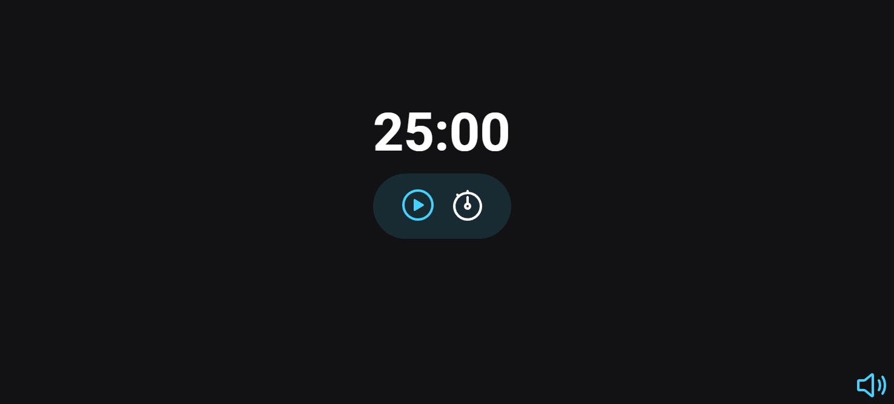

<h1 align="center"> Projeto 06 TIMER </h1>

Projeto 06 da trilha explorer rocketseat, onde foi desenvolvido um timer.

  <a href="#-tecnologias">Tecnologias</a>&nbsp;&nbsp;&nbsp;|&nbsp;&nbsp;&nbsp;
  <a href="#-projeto">Projeto</a>&nbsp;&nbsp;&nbsp;|&nbsp;&nbsp;&nbsp;
  <a href="#memo-licença">Licença</a>

  

 

  

## 🚀 Tecnologias

Esse projeto foi desenvolvido com as seguintes tecnologias:

- HTML e CSS
- JavaScript
- Git e Github

## 💻 Projeto

O Timer é um projeto em que o usuaario pode escolher um tempo com musica de background.

## Licença

Esse projeto está sob a licença MIT.

---
